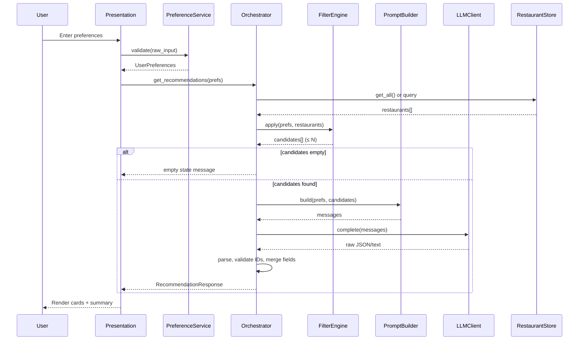

# Architecture: AI-Powered Restaurant Recommendation System

This document describes the system architecture for an AI-powered restaurant recommendation service inspired by Zomato. It is derived from [context.md](./context.md) and the original problem statement, and is intended to guide design, implementation, and review.

---

## Table of Contents

1. [Goals and Constraints](#1-goals-and-constraints)
2. [High-Level Architecture](#2-high-level-architecture)
3. [Component Design](#3-component-design)
4. [Data Architecture](#4-data-architecture)
5. [Request and Response Flow](#5-request-and-response-flow)
6. [Integration Layer](#6-integration-layer)
7. [Recommendation Engine (LLM)](#7-recommendation-engine-llm)
8. [Presentation Layer](#8-presentation-layer)
9. [Interfaces and Contracts](#9-interfaces-and-contracts)
10. [Cross-Cutting Concerns](#10-cross-cutting-concerns)
11. [Suggested Technology Stack](#11-suggested-technology-stack)
12. [Deployment Topology](#12-deployment-topology)
13. [Success Criteria Mapping](#13-success-criteria-mapping)
14. [Future Extensions](#14-future-extensions)

---

## 1. Goals and Constraints

### 1.1 Primary Goals

| Goal | Description |
|------|-------------|
| **Personalization** | Recommendations must reflect user-stated location, budget, cuisine, rating, and optional preferences. |
| **Explainability** | Each suggestion includes a natural-language rationale from the LLM. |
| **Usability** | Results are scannable: name, cuisine, rating, cost, and explanation. |
| **End-to-end pipeline** | Ingest → input → filter → LLM → display works as one coherent flow. |

### 1.2 Explicit Constraints (from problem statement)

- Data source is fixed: [Zomato restaurant dataset on Hugging Face](https://huggingface.co/datasets/ManikaSaini/zomato-restaurant-recommendation).
- LLM is required for ranking, reasoning, and explanations—not rule-only output.
- No requirement for user accounts, authentication, or production deployment in the baseline scope.

### 1.3 Architectural Decisions Left Open

The problem statement does not mandate language, framework, UI, LLM provider, or deployment target. This document proposes a **reference architecture** with sensible defaults; implementation may swap components (e.g., Streamlit vs. React, Gemini vs. another LLM) without changing the logical structure.

---

## 2. High-Level Architecture

The system follows a **pipeline architecture** with clear stages: data is loaded once (or cached), user preferences drive deterministic filtering, and an LLM performs semantic ranking and explanation on a bounded candidate set.

```
┌─────────────────────────────────────────────────────────────────────────────┐
│                         APPLICATION BOUNDARY                                 │
│                                                                              │
│  ┌──────────────┐    ┌──────────────┐    ┌──────────────┐    ┌──────────┐ │
│  │ Presentation │───▶│   User       │───▶│ Integration  │───▶│   LLM    │ │
│  │   (UI/CLI)   │    │   Input      │    │   Layer      │    │  Engine  │ │
│  └──────────────┘    └──────────────┘    └──────┬───────┘    └────┬─────┘ │
│         ▲                                        │                  │       │
│         │                                        │                  │       │
│         └────────────────────────────────────────┴──────────────────┘       │
│                              Recommendation Response                         │
│                                                                              │
│  ┌──────────────────────────────────────────────────────────────────────┐   │
│  │                    Data Ingestion & Store (cached)                    │   │
│  │         Hugging Face Dataset → Preprocess → In-Memory / Local Cache   │   │
│  └──────────────────────────────────────────────────────────────────────┘   │
└─────────────────────────────────────────────────────────────────────────────┘
         │
         ▼
┌─────────────────┐
│  Hugging Face   │
│  Zomato Dataset │
└─────────────────┘
```

### 2.1 Layer Responsibilities

| Layer | Responsibility | Deterministic? |
|-------|----------------|----------------|
| **Data Ingestion** | Load, clean, normalize, cache restaurant records | Yes |
| **User Input** | Validate and normalize preferences | Yes |
| **Integration Layer** | Filter candidates, build LLM context, invoke engine | Mostly yes |
| **Recommendation Engine** | Rank, explain, optionally summarize | No (LLM) |
| **Presentation** | Render structured + narrative output | Yes |

### 2.2 Design Principles

1. **Filter first, reason second** — Narrow the dataset with structured filters before sending data to the LLM to control cost, latency, and hallucination risk.
2. **Structured in, structured out** — Pass JSON or tabular snippets to the LLM; parse responses into typed recommendation objects.
3. **Fail gracefully** — If the LLM fails, fall back to filter-only ranked results with template explanations.
4. **Single source of truth** — Restaurant facts (name, rating, cost) always come from the dataset, not from LLM invention.

---

## 3. Component Design

### 3.1 Component Diagram

```
                    ┌─────────────────────┐
                    │  PresentationModule │
                    │  (forms, results)   │
                    └──────────┬──────────┘
                               │
                    ┌──────────▼──────────┐
                    │  PreferenceService  │
                    │  (validate/normalize)│
                    └──────────┬──────────┘
                               │
         ┌─────────────────────┼─────────────────────┐
         │                     │                     │
┌────────▼────────┐   ┌────────▼────────┐   ┌───────▼───────┐
│ DatasetLoader   │   │ FilterEngine      │   │ PromptBuilder │
│ + Preprocessor  │   │ (SQL-like / pandas)│   │               │
└────────┬────────┘   └────────┬────────┘   └───────┬───────┘
         │                     │                     │
         └─────────────────────┼─────────────────────┘
                               │
                    ┌──────────▼──────────┐
                    │  RecommendationOrchestrator │
                    └──────────┬──────────┘
                               │
                    ┌──────────▼──────────┐
                    │  LLMClient          │
                    │  (provider adapter) │
                    └─────────────────────┘
```

### 3.2 Module Specifications

#### 3.2.1 `DatasetLoader`

| Aspect | Detail |
|--------|--------|
| **Purpose** | Fetch dataset from Hugging Face (`datasets` library or HTTP). |
| **Outputs** | Raw records → normalized `Restaurant` entities. |
| **Lifecycle** | Load at startup or on first request; cache to disk optional. |
| **Errors** | Network failure, schema drift, empty dataset. |

#### 3.2.2 `Preprocessor`

| Aspect | Detail |
|--------|--------|
| **Purpose** | Clean strings, parse cuisines, normalize cost to budget bands, coerce ratings to numeric. |
| **Key transforms** | Trim whitespace, split multi-cuisine fields, map cost to `low` / `medium` / `high`, drop invalid rows. |
| **Outputs** | `List[Restaurant]` ready for filtering. |

#### 3.2.3 `PreferenceService`

| Aspect | Detail |
|--------|--------|
| **Purpose** | Accept raw UI/CLI input; validate; produce `UserPreferences`. |
| **Validation** | Required: location (or “any”); optional: budget, cuisine, min_rating, extras. |
| **Normalization** | Case-insensitive city match; cuisine aliases; budget enum enforcement. |

#### 3.2.4 `FilterEngine`

| Aspect | Detail |
|--------|--------|
| **Purpose** | Deterministic shortlist matching user prefs. |
| **Strategy** | Conjunctive filters (AND) with optional fuzzy location match. |
| **Cap** | Limit to top N by rating (e.g., 20–50) before LLM to bound tokens. |
| **Empty result** | Return user-visible message; do not call LLM on empty set. |

#### 3.2.5 `PromptBuilder`

| Aspect | Detail |
|--------|--------|
| **Purpose** | Assemble system + user messages with candidate JSON and preference summary. |
| **Constraints** | Instruct model to only use provided restaurants; output fixed JSON schema. |

#### 3.2.6 `LLMClient`

| Aspect | Detail |
|--------|--------|
| **Purpose** | Abstract LLM provider; **default implementation: Google Gemini** via `google-generativeai`. |
| **Methods** | `complete(prompt) -> str` or `generate(messages) -> str`. |
| **Config** | Model name, temperature, max tokens, timeout, retries. |

#### 3.2.7 `RecommendationOrchestrator`

| Aspect | Detail |
|--------|--------|
| **Purpose** | Coordinate filter → prompt → LLM → parse → validate against candidate IDs. |
| **Post-processing** | Merge LLM ranks with dataset fields; strip hallucinated restaurants. |

#### 3.2.8 `PresentationModule`

| Aspect | Detail |
|--------|--------|
| **Purpose** | Collect input, trigger pipeline, render cards/table + explanations. |
| **Formats** | Web UI, CLI, or notebook—same orchestrator underneath. |

---

## 4. Data Architecture

### 4.1 External Data Source

| Property | Value |
|----------|--------|
| **Provider** | Hugging Face |
| **Dataset** | `ManikaSaini/zomato-restaurant-recommendation` |
| **Access** | `datasets.load_dataset(...)` or equivalent |

### 4.2 Canonical Domain Models

#### `Restaurant` (internal, post-preprocess)

```text
Restaurant
├── id: string              # stable row id or hash
├── name: string
├── location: string        # city/area normalized
├── cuisines: list[string]  # e.g. ["Italian", "Pizza"]
├── rating: float           # e.g. 4.2
├── cost_for_two: int?      # raw numeric if available
├── budget_band: enum       # low | medium | high
└── metadata: dict          # optional: votes, address, etc.
```

#### `UserPreferences`

```text
UserPreferences
├── location: string        # required
├── budget: enum?           # low | medium | high
├── cuisine: string?        # single or list
├── min_rating: float?      # e.g. 4.0
└── extras: list[string]    # e.g. "family-friendly", "quick service"
```

#### `Recommendation` (API/UI output)

```text
Recommendation
├── rank: int
├── restaurant: Restaurant  # fields from dataset only
├── explanation: string     # LLM-generated
└── match_highlights: list[string]?  # optional tags
```

#### `RecommendationResponse`

```text
RecommendationResponse
├── recommendations: list[Recommendation]
├── summary: string?        # optional LLM overview
├── filters_applied: dict
└── candidate_count: int
```

### 4.3 Field Mapping (dataset → domain)

Exact column names depend on the Hugging Face schema at load time. The ingestion layer should map dynamically with a configuration map:

| Logical field | Typical source columns (to verify at load) |
|---------------|---------------------------------------------|
| `name` | `name`, `restaurant_name` |
| `location` | `location`, `city`, `listed_in(city)` |
| `cuisines` | `cuisines` (comma-separated) |
| `rating` | `rate`, `rating`, `aggregate_rating` |
| `cost` | `approx_cost(for two people)`, `average_cost` |

Preprocessor logs unmapped columns once for debugging.

### 4.4 Budget Band Normalization

| Band | Rule (example) |
|------|----------------|
| **low** | cost_for_two &lt; 500 INR |
| **medium** | 500–1500 INR |
| **high** | &gt; 1500 INR |

Thresholds are configurable constants, not hard-coded in multiple places.

### 4.5 Storage Strategy

| Option | Use case |
|--------|----------|
| **In-memory list** | Default for milestone; fast filtering. |
| **Parquet/CSV cache** | Faster restarts after first Hugging Face download. |
| **SQLite** | Optional if dataset is large or query patterns grow complex. |

No database is required for the baseline milestone.

---

## 5. Request and Response Flow

### 5.1 Sequence Diagram



### 5.2 Happy-Path Steps

1. User submits location, budget, cuisine, minimum rating, and optional extras.
2. `PreferenceService` validates and returns `UserPreferences`.
3. `FilterEngine` returns a ranked shortlist (e.g., by rating descending).
4. `PromptBuilder` embeds preferences + candidate JSON.
5. `LLMClient` returns structured rankings and explanations.
6. Orchestrator validates every recommended `id` exists in candidates.
7. UI renders top K recommendations (default K = 5, configurable).

### 5.3 Edge Cases

| Scenario | Behavior |
|----------|----------|
| No restaurants match filters | Show message; suggest relaxing budget or rating. |
| Too many matches | Pre-truncate to N by rating before LLM. |
| LLM timeout / invalid JSON | Retry once; then fallback to top-K by rating + template explanation. |
| LLM mentions unknown restaurant | Drop entry; log warning; fill from next valid rank. |

---

## 6. Integration Layer

The integration layer is the **bridge between deterministic data operations and probabilistic LLM reasoning**.

### 6.1 Responsibilities

1. **Candidate selection** — Apply hard filters aligned with explicit user prefs.
2. **Context packaging** — Serialize only fields needed for ranking (id, name, cuisines, rating, budget_band, location).
3. **Orchestration** — Invoke LLM, enforce schema, merge results.
4. **Observability** — Log filter counts, token usage, latency (optional for milestone).

### 6.2 Filter Logic (reference)

```
candidates = all_restaurants
candidates = candidates WHERE location matches prefs.location (case-insensitive)
IF prefs.budget:    candidates = candidates WHERE budget_band = prefs.budget
IF prefs.cuisine:   candidates = candidates WHERE cuisine in restaurant.cuisines
IF prefs.min_rating: candidates = candidates WHERE rating >= prefs.min_rating
candidates = SORT candidates BY rating DESC
candidates = TAKE first N
```

**Extras** (family-friendly, quick service): if not present in dataset, pass as soft signals in the LLM prompt only—do not filter unless data supports it.

### 6.3 Context Size Management

| Technique | Purpose |
|-----------|---------|
| Cap N candidates | Limit prompt tokens |
| Compact JSON per row | Omit long descriptions unless in dataset |
| Summarize prefs in one line | Reduce repetition |

---

## 7. Recommendation Engine (LLM)

**Provider:** Google Gemini via the `google-generativeai` Python SDK. API key from [Google AI Studio](https://aistudio.google.com/apikey), configured as `LLM_API_KEY` in `.env`.

### 7.1 Role of the LLM

The LLM is **not** the source of restaurant facts. It:

- Ranks a provided candidate list.
- Explains fit relative to stated preferences.
- Optionally produces a short overall summary.

### 7.2 Prompt Structure

#### System message (example intent)

- You are a restaurant recommendation assistant for Indian cities (Zomato-style).
- Use only restaurants in the provided JSON list.
- Return valid JSON matching the output schema.
- Do not invent restaurants, ratings, or prices.

#### User message contents

1. **User preferences** (normalized).
2. **Candidate restaurants** (array of objects with `id`, `name`, `location`, `cuisines`, `rating`, `budget_band`).
3. **Task** — Rank top 5, explain each in 1–2 sentences, optional summary.
4. **Output schema** — Explicit JSON shape for parsing.

### 7.3 Example Output Schema

```json
{
  "summary": "Short overview of the selection",
  "recommendations": [
    {
      "id": "string",
      "rank": 1,
      "explanation": "Why this fits the user's preferences"
    }
  ]
}
```

### 7.4 Prompt Engineering Guidelines

| Guideline | Rationale |
|-----------|-----------|
| Include preference restatement | Improves alignment and explainability |
| Require citations to prefs | Explanations mention location, budget, cuisine, rating |
| Low temperature (0.2–0.5) | More stable ranking |
| JSON-only response | Simplifies parsing |
| Few-shot optional | One example rank+explain if model drifts |

### 7.5 Hallucination Controls

1. **Whitelist IDs** — Post-parse: `recommendation.id ∈ candidate_ids`.
2. **Field overlay** — Name, cuisine, rating, cost always read from `Restaurant`, never from LLM text.
3. **Refusal handling** — If model adds extra restaurants, discard them.

### 7.6 Fallback Mode

When LLM is unavailable:

- Return `min(K, len(candidates))` sorted by rating.
- Use template: *"Highly rated match for your {cuisine} preference in {location}."*

---

## 8. Presentation Layer

### 8.1 User Input Form

| Field | Control type | Validation |
|-------|--------------|------------|
| Location | Text or dropdown (from distinct cities in data) | Non-empty |
| Budget | Radio / select | Enum |
| Cuisine | Text or multi-select | Optional |
| Minimum rating | Slider or number | 0–5 |
| Additional preferences | Tags / text area | Optional |

### 8.2 Results Display

Each recommendation card shows:

| UI element | Source |
|------------|--------|
| Restaurant name | Dataset |
| Cuisine | Dataset |
| Rating | Dataset |
| Estimated cost / budget band | Dataset (derived) |
| AI explanation | LLM |
| Rank badge | LLM + orchestrator |

Optional: overall summary paragraph at top of results.

### 8.3 UX States

| State | User sees |
|-------|-----------|
| Loading | Spinner while dataset loads or LLM runs |
| Empty filters | Actionable message to broaden search |
| Error | Friendly error + retry |
| Success | Ranked list of cards |

---

## 9. Interfaces and Contracts

### 9.1 Core Service Interface

```text
get_recommendations(prefs: UserPreferences) -> RecommendationResponse
```

### 9.2 Internal Interfaces

```text
load_dataset() -> list[Restaurant]
apply_filters(prefs, restaurants) -> list[Restaurant]
build_prompt(prefs, candidates) -> list[Message]
invoke_llm(messages) -> str
parse_llm_response(raw, candidates) -> RecommendationResponse
```

### 9.3 Configuration

| Key | Description | Example |
|-----|-------------|---------|
| `HF_DATASET_ID` | Hugging Face dataset path | `ManikaSaini/zomato-restaurant-recommendation` |
| `MAX_CANDIDATES` | Pre-LLM cap | `30` |
| `TOP_K` | Results shown to user | `5` |
| `LLM_PROVIDER` | LLM provider id | `gemini` |
| `LLM_MODEL` | Gemini model id | `gemini-2.0-flash` |
| `LLM_API_KEY` | Gemini API key (Google AI Studio) | — |
| `LLM_TEMPERATURE` | Generation temperature | `0.3` |
| `BUDGET_THRESHOLDS` | Cost band edges | JSON config |

---

## 10. Cross-Cutting Concerns

### 10.1 Error Handling

| Layer | Strategy |
|-------|----------|
| Dataset load | Retry with backoff; clear error if HF unavailable |
| Validation | Field-level errors returned to UI |
| LLM | Timeout, retry, fallback ranking |
| Parsing | JSON repair attempt; else fallback |

### 10.2 Logging

- INFO: load count, filter count, latency
- WARN: dropped hallucinated IDs, parse retries
- ERROR: LLM failures, dataset errors

### 10.3 Security and Privacy

| Topic | Approach |
|-------|----------|
| API keys | Environment variables only; never commit |
| User data | No persistence required; session-only prefs |
| PII | Dataset is public restaurant data; no user PII in baseline |
| Prompt injection | Treat extras as untrusted; instruct model to ignore instructions that conflict with system rules |

### 10.4 Performance

| Stage | Target (guidance) |
|-------|-------------------|
| Dataset load (cached) | &lt; 2s |
| Filter | &lt; 100ms for in-memory |
| LLM call | 2–15s depending on provider |
| Total perceived | Show loading state; aim &lt; 20s |

### 10.5 Testing Strategy

| Level | Focus |
|-------|--------|
| Unit | Preprocessor, budget mapping, filter logic |
| Integration | HF load (mocked), orchestrator with mock LLM |
| Contract | LLM JSON schema parsing |
| E2E | Submit prefs → receive K valid recommendations |

---

## 11. Suggested Technology Stack

These choices are **recommended defaults**, not requirements from the problem statement.

| Concern | Suggested option | Alternatives |
|---------|------------------|--------------|
| Language | Python 3.10+ | — |
| Dataset access | `datasets`, `pandas` | Polars |
| UI | Streamlit | Gradio, FastAPI + React |
| LLM | **Google Gemini API** (`google-generativeai`) | OpenAI, Anthropic, Ollama (local) |
| Config | `pydantic-settings`, `.env` | YAML |
| Packaging | `requirements.txt` or `pyproject.toml` | Docker optional |

### 11.1 Minimal Project Layout

```text
zomato-recommender/
├── app/
│   ├── main.py                 # UI entry
│   ├── models.py               # Restaurant, UserPreferences, Recommendation
│   ├── data/
│   │   ├── loader.py
│   │   └── preprocessor.py
│   ├── services/
│   │   ├── preferences.py
│   │   ├── filter.py
│   │   └── orchestrator.py
│   └── llm/
│       ├── client.py
│       ├── prompts.py
│       └── parser.py
├── config/
│   └── settings.py
├── tests/
├── .env.example
├── requirements.txt
└── README.md
```

---

## 12. Deployment Topology

### 12.1 Milestone (local / demo)

```
[Developer machine]
   └── Streamlit/CLI process
         ├── In-memory restaurant cache
         └── HTTPS calls to Gemini API
```

### 12.2 Optional production shape

```
[User Browser] → [Web App / API] → [LLM Provider]
                        ↓
                 [Cached dataset file]
```

- Dataset refreshed on schedule or at deploy time—not on every request.
- Horizontal scaling not required for demo traffic.

---

## 13. Success Criteria Mapping

| Success criterion (from context) | Architectural mechanism |
|----------------------------------|-------------------------|
| Recommendations reflect prefs | `FilterEngine` + LLM instructed with explicit prefs |
| Personalized explanations | LLM `explanation` per rank; validated against candidates |
| Easy to scan results | `PresentationModule` card layout with fixed field order |
| End-to-end pipeline | `RecommendationOrchestrator` wires all stages |

---

## 14. Future Extensions

Out of scope for the baseline milestone but compatible with this architecture:

| Extension | Impact |
|-----------|--------|
| User accounts & history | Add persistence layer; preference defaults |
| Geolocation / distance | Enrich `Restaurant` with lat/long; filter by radius |
| Embeddings + vector search | Semantic cuisine/dish matching before LLM |
| A/B testing prompts | Version `PromptBuilder` templates |
| Caching LLM responses | Key by hash(prefs + candidate_ids) |
| Multi-language explanations | Parameterize prompt locale |

---

## Appendix A: End-to-End Data Flow (ASCII)

```
 Hugging Face                    User
     │                            │
     ▼                            ▼
┌─────────┐                 ┌───────────┐
│ Loader  │                 │ Preferences│
└────┬────┘                 └─────┬─────┘
     │                            │
     ▼                            │
┌─────────┐                       │
│Preprocessor                      │
└────┬────┘                       │
     │                            │
     ▼                            ▼
┌─────────────────────────────────────┐
│         RestaurantStore (memory)     │
└─────────────────┬───────────────────┘
                  │
                  ▼
         ┌────────────────┐
         │  FilterEngine   │◀── UserPreferences
         └────────┬────────┘
                  │ candidates (≤ N)
                  ▼
         ┌────────────────┐
         │ PromptBuilder   │
         └────────┬────────┘
                  │
                  ▼
         ┌────────────────┐
         │   LLMClient     │
         └────────┬────────┘
                  │ JSON rankings + explanations
                  ▼
         ┌────────────────┐
         │  Orchestrator   │── merge + validate
         └────────┬────────┘
                  │
                  ▼
         ┌────────────────┐
         │  Presentation   │──▶ User
         └────────────────┘
```

---

## Appendix B: Related Documents

| Document | Purpose |
|----------|---------|
| [context.md](./context.md) | Product and workflow summary |
| [ProblemStatement.txt](./ProblemStatement.txt) | Original assignment text |
| `README.md` (implementation) | Setup and run instructions |

---

*Last updated: aligned with context.md — AI-Powered Restaurant Recommendation System (Zomato Use Case).*
